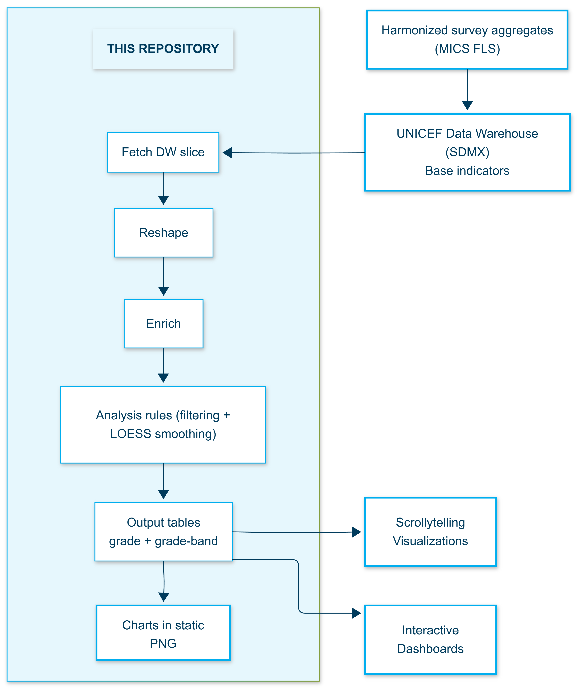

# Technical Note

This note provides a practical overview of how Learning Gradient data is retrieved from the UNICEF Global Data Warehouse and transformed into analysis outputs used in the public scrollytelling story and the exported chart set generated by this repository. This document summarizes the data source, the analytical views supported, the processing steps applied in this repository, the outputs produced, and how to run the workflow locally.

## Contents

1. [Where the data comes from](#where-the-data-comes-from)
2. [Grade-level and grade-band outputs](#grade-level-and-grade-band-outputs)
3. [What this repository does](#what-this-repository-does)
4. [Outputs](#outputs)
5. [Overview of the flow of data](#overview-of-the-flow-of-data)
6. [Default settings and user controls](#default-settings-and-user-controls)
7. [How to run the workflow](#how-to-run-the-workflow)
8. [Repository structure (high level)](#repository-structure-high-level)

---

## Where the data comes from

This repository retrieves Learning Gradient indicators from the [UNICEF Global Data Warehouse](https://sdmx.data.unicef.org/webservice/data.html) using the SDMX REST API. The indicators are structured by country, time period, subject (reading, numeracy), disaggregation (sex, wealth quintile, area of residence), grade or grade-band, and metric (proficiency rate and sample size). Underlying MICS microdata are harmonized through UNICEF internal processes before aggregated results are published to the Data Warehouse.

See [UNICEF DW API Data Description](../0003_data_reference/000301_UNICEF_DW_API_Data_Description.md) for codes, dimension values, and query examples.


---

## Grade-level and grade-band outputs

The Learning Gradient analysis supports two complementary views derived from Data Warehouse indicators.

**Grade-level** outputs are used to produce country trajectories across grade progression steps and draw from by-grade indicators stored in the Data Warehouse.

**Grade-band** outputs group grade progression steps into three education stages and draw from by-grade-band indicators stored in the Data Warehouse:

- Early Primary (1–3)
- End of Primary (4–6)
- Lower Secondary (7–9)

---

## What this repository does

After retrieving data from the Data Warehouse, the pipeline prepares the data for analysis and visualization. It reshapes the data into a consistent structure, including separating reading and numeracy into a subject dimension, and enriches the dataset with country and region metadata (UNICEF reference files) and income classifications (World Bank API or cached snapshots). The workflow applies clearly defined analytical rules, including selecting the most recent available year per country and applying minimum observation thresholds where required. LOESS smoothing (span = 1) is computed within the pipeline for visualization purposes. The pipeline then writes standardized output tables and exports PNG charts that recreate the scrollytelling visuals. Chart production is implemented in `0203_produce_charts.R`, which reads the output tables and writes figures to `03_output/0302_figures/`.

For Pakistan, sub-national territories (PAK-BLC, PAK-KPW, PAK-SND) are dropped and PAK-PJB is relabeled to PAK so that Pakistan appears as a single national entry in outputs. Punjab is used because it represents more than half of the national population.

---

## Outputs

The pipeline produces outputs in the `03_output/` directory, organized into tables and figures.

**Tables (CSV)**

- `03_output/0301_tables/030101_output_grade.csv` — grade-level trajectories by country, used for the trajectory visualizations
- `03_output/0301_tables/030102_output_grade_band.csv` — education-stage comparisons, used for wealth and stage-based visualizations

**Figures (PNG)**

PNG chart files are written to `03_output/0302_figures/` by `0203_produce_charts.R`.

The tables include weighted and unweighted proficiency rates, weighted and unweighted sample sizes, LOESS-smoothed values, country metadata (names and regional classifications), and disaggregation fields (type and category labels).

Full column definitions and schema details are documented in [Output Data Structure](../0003_data_reference/000302_Output_Data_Structure.md).

---

## Overview of the flow of data



---

## Default settings and user controls

The exported charts produced by this repository follow the same default analytical settings used in the scrollytelling story. These defaults are intended to balance statistical validity, interpretability, and cross-country comparability. The companion online dashboards start from the same defaults and allow users to adjust key settings and filters interactively.

By default, results are based on survey-weighted estimates to reflect the nationally representative nature of MICS data and its complex sampling design. The mean is used as the default summary measure because it can be interpreted as the share of children demonstrating foundational skills and supports consistent aggregation across countries and population groups. For grade trajectories, LOESS smoothing is applied to weighted estimates (span = 1) to highlight overall patterns of progression while reducing volatility that can arise when grade-level sample sizes are uneven or sparse.

Basic data-quality rules are applied by default to limit unstable subgroup estimates. Estimates are shown only where the relevant sample size is 25 or greater, using weighted or unweighted counts depending on the selected metric. The pipeline is parameterized so users can easily change key choices such as the minimum observation threshold and missingness tolerances. In the dashboards, these parameters are exposed as interactive controls so users can test how patterns change under alternative settings.


## How to run the workflow

From the repository root directory, run:

```r
source("run_all.R")
```

Before first execution, run `source("setup_renv.R")` to restore pinned package versions from `renv.lock`, then restart R. After setup, run `source("run_all.R")` to fetch data, rebuild output tables, and export chart images to `03_output/0302_figures/`.

Alternatively, set `FORCE_RENV_RESTORE <- TRUE` before sourcing `run_all.R` to trigger environment restoration automatically as part of the pipeline run:

```r
FORCE_RENV_RESTORE <- TRUE
source("run_all.R")
```

---

## Repository structure (high level)

```
foundational-learning-gradient/
├── 00_documentation/
│   ├── 0001_technical_note/
│   ├── 0002_reproducibility/
│   └── 0003_data_reference/
├── 01_data/
│   └── 0101_learning_gradient_unicef_dw.csv *
├── 02_scripts/
│   ├── 0201_load.R
│   ├── 0202_transform.R
│   └── 0203_produce_charts.R
├── 03_output/
│   ├── 0301_tables/
│   │   ├── 030101_output_grade.csv *
│   │   └── 030102_output_grade_band.csv *
│   └── 0302_figures/
│       ├── 030201_country_by_grade_reading.png *
│       ├── 030202_country_by_grade_numeracy.png *
│       ├── 030203_wealth_by_grade_band_all_reading.png *
│       ├── 030204_wealth_by_grade_band_split_reading.png *
│       └── 030205_wealth_by_grade_band_side_by_side_reading.png *
├── project_config.R
├── renv.lock
├── run_all.R
├── setup_renv.R
└── README.md
```

\* Generated at runtime by the pipeline. These files are not committed to the repository.
